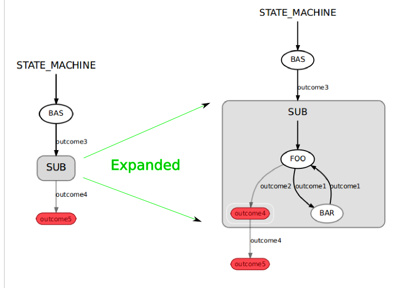
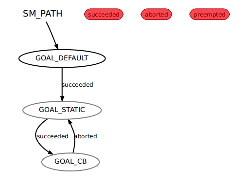

Title: Readme
Date: 2020-05-20 16:50
Modified: 2020-05-20 20:50
Category: learn
Tags: smach
Authors: Qlong
Summary:ros smach学习笔记

## ROS+smach
### ***smach和smach viewr基本说明***
1. 完整的smach安装指令：
```
sudo apt-get install ros-melodic-smach*
```
建议及时更新一些系统软件，不然可能装不上。

2. 启动监视器viewer的指令：
```
rosrun smach_viewer smach_viewer.py
```

3. 以下代码加到状态机sm运行之后，才会启动监视器功能，注意根据实际改此处sm的名字。
```
    sis = smach_ros.IntrospectionServer('server_name', sm, '/SM_ROOT')
    sis.start()
    # Execute SMACH plan
    outcome = sm.execute()
    rospy.spin() 
    sis.stop()
```
    
### ***创建一个状态机***
#### 创建状态
1. 从State基类继承，并有两个方案。
```
  class Foo(smach.State):
     def __init__(self, outcomes=['outcome1', 'outcome2']):
       # Your state initialization goes here

     def execute(self, userdata):
        # Your state execution goes here
        if xxxx:
            return 'outcome1'
        else:
            return 'outcome2'
```
2. 在init方法中，可以初始化状态类。
   确保切勿阻塞init方法！
   如果需要等待系统的其他部分启动，请从单独的线程执行此操作。
   **用户的初始化代码写在这里**

3. 在execute方法中，可以执行所需的任何代码。
   只要您愿意，可以使用此方法进行阻止。
   从此方法返回后，当前状态即告完成。
   **用户的执行代码写在这里。**

4. 状态结束时，它返回结果。
   每个状态都有许多与之相关的可能结果。
   结果是描述状态如何完成的用户定义的字符串。
   例如，一组可能的结果可能是（“成功”，“失败”，“真棒”）。
   将根据前一个状态的结果指定到下一个状态的转换。
   **用户可以return字符串结果。**

#### 把状态加入到状态机
1. 状态机是包含多个状态的容器。
   将状态添加到状态机容器时，可以指定状态之间的转换。
```
  sm = smach.StateMachine(outcomes=['outcome4','outcome5'])
  with sm:
     smach.StateMachine.add('FOO', Foo(),
                            transitions={'outcome1':'BAR',
                                         'outcome2':'outcome4'})
     smach.StateMachine.add('BAR', Bar(),
                            transitions={'outcome2':'FOO'})
```
2. 初始化状态机的时候，也会定义状态机的输出。
   用add方法把状态加入，同时用transitions参数设定结果与状态变化的对应关系。
     

#### 一个例子
```
#!/usr/bin/env python

import rospy
import smach

# define state Foo
class Foo(smach.State):
    def __init__(self):
        smach.State.__init__(self, outcomes=['outcome1','outcome2'])
        self.counter = 0

    def execute(self, userdata):
        rospy.loginfo('Executing state FOO')
        if self.counter < 3:
            self.counter += 1
            return 'outcome1'
        else:
            return 'outcome2'


# define state Bar
class Bar(smach.State):
    def __init__(self):
        smach.State.__init__(self, outcomes=['outcome2'])

    def execute(self, userdata):
        rospy.loginfo('Executing state BAR')
        return 'outcome2'
        
# main
def main():
    rospy.init_node('smach_example_state_machine')

    # Create a SMACH state machine
    sm = smach.StateMachine(outcomes=['outcome4', 'outcome5'])

    # Open the container
    with sm:
        # Add states to the container
        smach.StateMachine.add('FOO', Foo(), 
                               transitions={'outcome1':'BAR', 
                                            'outcome2':'outcome4'})
        smach.StateMachine.add('BAR', Bar(), 
                               transitions={'outcome2':'FOO'})

    # Execute SMACH plan
    outcome = sm.execute()

if __name__ == '__main__':
    main()
```
1. 创建两个状态。
2. main函数中初始化节点，然后初始化状态机，并获取状态机最终输出结果

#### 拓展说明
1. smatch自带一些默认状态类
2. smatch还自带一些默认状态机容器
这些将在之后的部分中说明


### ***在状态之间传递数据***
#### 指定用户数据
1. 状态之间需要数据传递，这种数据叫用户数据，构造状态类的时候，初始化需要设置用户数据。
2. input_keys列表枚举所有的状态需要运行的输入。不能写入，保持不变。
3. output_keys列表枚举所有的状态提供输出。可以写入。
```
  class Foo(smach.State):
     def __init__(self, outcomes=['outcome1', 'outcome2'],
                        input_keys=['foo_input'],
                        output_keys=['foo_output'])

     def execute(self, userdata):
        # Do something with userdata
        if userdata.foo_input == 1:
            return 'outcome1'
        else:
            userdata.foo_output = 3
            return 'outcome2'
```
 

#### 连接用户数据
1. 在初始化状态机容器的时候，除了设置输入输出连接，还要通过状态机数据建立映射。
```
  sm_top = smach.StateMachine(outcomes=['outcome4','outcome5'],
                          input_keys=['sm_input'],
                          output_keys=['sm_output'])
  with sm_top:
     smach.StateMachine.add('FOO', Foo(),
                            transitions={'outcome1':'BAR',
                                         'outcome2':'outcome4'},
                            remapping={'foo_input':'sm_input',
                                       'foo_output':'sm_data'})
     smach.StateMachine.add('BAR', Bar(),
                            transitions={'outcome2':'FOO'},
                            remapping={'bar_input':'sm_data',
                                       'bar_output1':'sm_output'})
```

2. 注意，这里重映射的'x':'y'中，x为状态数据，y为状态机数据。（状态机数据可以是输入输出，也可以是中间数据）
3. 如果状态数据和状态机数据名字一样，可以不用重新映射，但是最好写上，比如'x':'x'
4. 两个状态的输入输出数据通过重新映射，通过同一个状态机中间数据实现了连接。
```
FOO: remapping={'foo_output':'sm_user_data'}
BAR: remapping={'bar_input':'sm_user_data'}
```
注意此处的sm_user_data也需要定义一下，比如：
```
sm.userdata.sm_user_data = 0
```
5. 当然状态数据也可以和状态机输入输出数据连接。
```
BAR: remapping={'bar_output':'sm_output'}
FOO: remapping={'foo_input':'sm_input'}
```


```
#!/usr/bin/env python

import roslib; roslib.load_manifest('smach_tutorials')
import rospy
import smach
import smach_ros

# define state Foo
class Foo(smach.State):
    def __init__(self):
        smach.State.__init__(self, 
                             outcomes=['outcome1','outcome2'],
                             input_keys=['foo_counter_in'],
                             output_keys=['foo_counter_out'])

    def execute(self, userdata):
        rospy.loginfo('Executing state FOO')
        if userdata.foo_counter_in < 3:
            userdata.foo_counter_out = userdata.foo_counter_in + 1
            return 'outcome1'
        else:
            return 'outcome2'

# define state Bar
class Bar(smach.State):
    def __init__(self):
        smach.State.__init__(self, 
                             outcomes=['outcome1'],
                             input_keys=['bar_counter_in'])
        
    def execute(self, userdata):
        rospy.loginfo('Executing state BAR')
        rospy.loginfo('Counter = %f'%userdata.bar_counter_in)        
        return 'outcome1'

def main():
    rospy.init_node('smach_example_state_machine')

    # Create a SMACH state machine
    sm = smach.StateMachine(outcomes=['outcome4'])
    sm.userdata.sm_counter = 0

    # Open the container
    with sm:
        # Add states to the container
        smach.StateMachine.add('FOO', Foo(), 
                               transitions={'outcome1':'BAR', 
                                            'outcome2':'outcome4'},
                               remapping={'foo_counter_in':'sm_counter', 
                                          'foo_counter_out':'sm_counter'})
        smach.StateMachine.add('BAR', Bar(), 
                               transitions={'outcome1':'FOO'},
                               remapping={'bar_counter_in':'sm_counter'})


    # Execute SMACH plan
    outcome = sm.execute()


if __name__ == '__main__':
    main()
```

### ***创建分层状态机***

1.首先我们有很多状态
```
  # State Foo
  class Foo(smach.State):
     def __init__(self, outcomes=['outcome1', 'outcome2'])
     
     def execute(self, userdata):
        return 'outcome1'

  # State Bar
  class Bar(smach.State):
     def __init__(self, outcomes=['outcome1'])
     
     def execute(self, userdata):
        return 'outcome4'

  # State Bas
  class Bas(smach.State):
     def __init__(self, outcomes=['outcome3'])
     
     def execute(self, userdata):
        return 'outcome3'
```

2. 创建一个顶层状态机，添加状态，也可以添加另一个状态机作为底层状态机。


3. 举例
```
#!/usr/bin/env python

import roslib; roslib.load_manifest('smach_tutorials')
import rospy
import smach
import smach_ros

# define state Foo
class Foo(smach.State):
    def __init__(self):
        smach.State.__init__(self, outcomes=['outcome1','outcome2'])
        self.counter = 0

    def execute(self, userdata):
        rospy.loginfo('Executing state FOO')
        if self.counter < 3:
            self.counter += 1
            return 'outcome1'
        else:
            return 'outcome2'

# define state Bar
class Bar(smach.State):
    def __init__(self):
        smach.State.__init__(self, outcomes=['outcome1'])

    def execute(self, userdata):
        rospy.loginfo('Executing state BAR')
        return 'outcome1'
       
# define state Bas
class Bas(smach.State):
    def __init__(self):
        smach.State.__init__(self, outcomes=['outcome3'])

    def execute(self, userdata):
        rospy.loginfo('Executing state BAS')
        return 'outcome3'
def main():
    rospy.init_node('smach_example_state_machine')

    # Create the top level SMACH state machine
    sm_top = smach.StateMachine(outcomes=['outcome5'])
    
    # Open the container
    with sm_top:

        smach.StateMachine.add('BAS', Bas(),
                               transitions={'outcome3':'SUB'})

        # Create the sub SMACH state machine
        sm_sub = smach.StateMachine(outcomes=['outcome4'])

        # Open the container
        with sm_sub:

            # Add states to the container
            smach.StateMachine.add('FOO', Foo(), 
                                   transitions={'outcome1':'BAR', 
                                                'outcome2':'outcome4'})
            smach.StateMachine.add('BAR', Bar(), 
                                   transitions={'outcome1':'FOO'})

        smach.StateMachine.add('SUB', sm_sub,
                               transitions={'outcome4':'outcome5'})

    # Execute SMACH plan
    sis = smach_ros.IntrospectionServer('server_name', sm_top, '/SM_ROOT')
    sis.start()
    # Execute SMACH plan
    outcome = sm_top.execute()
    rospy.spin() 
    sis.stop()
    
if __name__ == '__main__':
    main() 
```

### ***从SMACH状态机内调用动作服务器***
1. 首先需要添加模块
```
from smach_ros import SimpleActionState
```
手动在状态里调用动作是可以的，但是smach有一些现成的动作状态。

2. 空目标信息的动作
```
sm = StateMachine(['succeeded','aborted','preempted'])
with sm:
    smach.StateMachine.add('TRIGGER_GRIPPER',
                           SimpleActionState('action_server_namespace',
                                             GripperAction),
                           transitions={'succeeded':'APPROACH_PLUG'})
```

3. 固定目标信息
```
sm = StateMachine(['succeeded','aborted','preempted'])
with sm:
    gripper_goal = Pr2GripperCommandGoal()
    gripper_goal.command.position = 0.07
    gripper_goal.command.max_effort = 99999
    StateMachine.add('TRIGGER_GRIPPER',
                      SimpleActionState('action_server_namespace',
                                        GripperAction,
                                        goal=gripper_goal),
                      transitions={'succeeded':'APPROACH_PLUG'})
```

4. 把状态中的用户信息用于动作目标信息
```
sm = StateMachine(['succeeded','aborted','preempted'])
with sm:
    StateMachine.add('TRIGGER_GRIPPER',
                      SimpleActionState('action_server_namespace',
                                        GripperAction,
                                        goal_slots=['max_effort', 
                                                    'position']),
                      transitions={'succeeded':'APPROACH_PLUG'},
                      remapping={'max_effort':'user_data_max',
                                 'position':'user_data_position'})
```
5. 目标回调
   在目标回调中，只要您在构造函数中列出input_keys，就可以使用userdata。
   回调的参数之一是默认目标。如果在构造函数中指定了“ goal = ...”，该对象将被传递到回调中。
```
sm = StateMachine(['succeeded','aborted','preempted'])
with sm:
    def gripper_goal_cb(userdata, goal):
       gripper_goal = GripperGoal()
       gripper_goal.position.x = 2.0
       gripper_goal.max_effort = userdata.gripper_input
       return gripper_goal

    StateMachine.add('TRIGGER_GRIPPER',
                      SimpleActionState('action_server_namespace',
                                        GripperAction,
                                        goal_cb=gripper_goal_cb,
                                        input_keys=['gripper_input'])
                      transitions={'succeeded':'APPROACH_PLUG'},
                      remapping={'gripper_input':'userdata_input'})
```
6. 可以将操作结果直接写到您所在州的用户数据中
```
sm = StateMachine(['succeeded','aborted','preempted'])
with sm:
    StateMachine.add('TRIGGER_GRIPPER',
                      SimpleActionState('action_server_namespace',
                                        GripperAction,
                                        result_slots=['max_effort', 
                                                      'position']),
                      transitions={'succeeded':'APPROACH_PLUG'},
                      remapping={'max_effort':'user_data_max',
                                 'position':'user_data_position'})
```
7. 结果回调与目标回调非常相似。
   它允许您从操作结果字段中读取任何数据，甚至返回与默认的“成功”，“抢占”，“中止”不同的结果。
```
sm = StateMachine(['succeeded','aborted','preempted'])
with sm:
    def gripper_result_cb(userdata, status, result):
       if status == GoalStatus.SUCCEEDED:
          userdata.gripper_output = result.num_iterations
          return 'my_outcome'

    StateMachine.add('TRIGGER_GRIPPER',
                      SimpleActionState('action_server_namespace',
                                        GripperAction,
                                        result_cb=gripper_result_cb,
                                        output_keys=['gripper_output'])
                      transitions={'succeeded':'APPROACH_PLUG'},
                      remapping={'gripper_output':'userdata_output'})
```
8. 在结果回调中，您将获得操作的状态，该状态将告诉您操作是成功，中止还是被抢占。
   另外，您还可以访问用户数据以及操作结果。（可选）您可以从结果回调中返回不同的结果。
   如果您不返回任何内容，则状态将以相应的操作结果返回。

9. 实例
```
#!/usr/bin/env python

import roslib; roslib.load_manifest('smach_tutorials')
import rospy
import smach
import smach_ros

from smach_tutorials.msg import TestAction, TestGoal
from actionlib import *
from actionlib_msgs.msg import *

# Create a trivial action server
class TestServer:
    def __init__(self,name):
        self._sas = SimpleActionServer(name,
                TestAction,
                execute_cb=self.execute_cb)

    def execute_cb(self, msg):
        if msg.goal == 0:
            self._sas.set_succeeded()
        elif msg.goal == 1:
            self._sas.set_aborted()
        elif msg.goal == 2:
            self._sas.set_preempted()

def main():
    rospy.init_node('smach_example_actionlib')

    # Start an action server
    server = TestServer('test_action')

    # Create a SMACH state machine
    sm0 = smach.StateMachine(outcomes=['succeeded','aborted','preempted'])

    # Open the container
    with sm0:
        # Add states to the container

        # Add a simple action state. This will use an empty, default goal
        # As seen in TestServer above, an empty goal will always return with
        # GoalStatus.SUCCEEDED, causing this simple action state to return
        # the outcome 'succeeded'
        smach.StateMachine.add('GOAL_DEFAULT',
                               smach_ros.SimpleActionState('test_action', TestAction),
                               {'succeeded':'GOAL_STATIC'})

        # Add another simple action state. This will give a goal
        # that should abort the action state when it is received, so we
        # map 'aborted' for this state onto 'succeeded' for the state machine.
        smach.StateMachine.add('GOAL_STATIC',
                               smach_ros.SimpleActionState('test_action', TestAction,
                                                       goal = TestGoal(goal=1)),
                               {'aborted':'GOAL_CB'})

        # Add another simple action state. This will give a goal
        # that should abort the action state when it is received, so we
        # map 'aborted' for this state onto 'succeeded' for the state machine.
        def goal_callback(userdata, default_goal):
            goal = TestGoal()
            goal.goal = 2
            return goal

        smach.StateMachine.add('GOAL_CB',
                               smach_ros.SimpleActionState('test_action', TestAction,
                                                       goal_cb = goal_callback),
                               {'aborted':'succeeded'})

        # For more examples on how to set goals and process results, see 
        # executive_smach/smach_ros/tests/smach_actionlib.py

    # Execute SMACH plan
    sis = smach_ros.IntrospectionServer('server_name', sm0, '/SM_ROOT')
    sis.start()
    # Execute SMACH plan
    outcome = sm0.execute()
    rospy.spin() 
    sis.stop()
    rospy.signal_shutdown('All done.')

if __name__ == '__main__':
    main()
```
